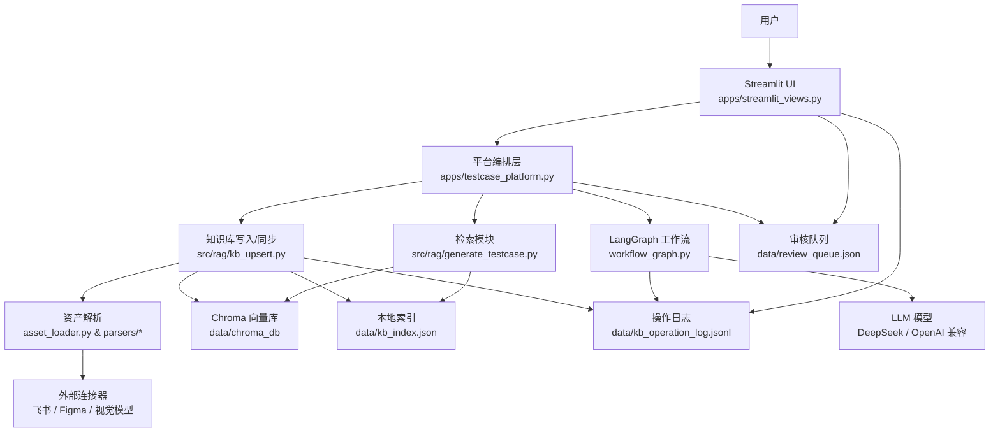
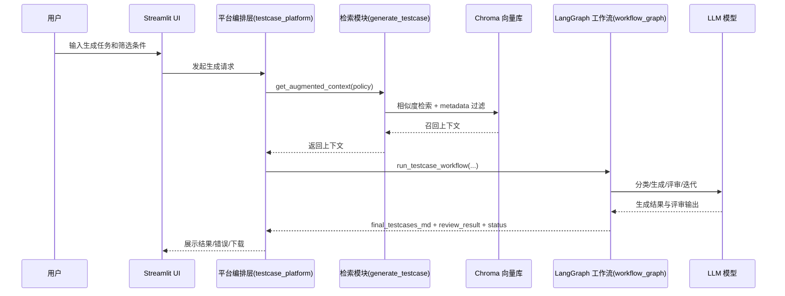

# 设计方案评审文档（测试用例生成平台）

> 本文基于当前代码实现整理，覆盖“设计方案”和“评审附录”。内容与当前代码、页面与已完成优化点一致，可直接用于评审。

## 1. 项目概述

### 1.1 平台要解决的问题
- 将需求、用例、UI 交互、API 文档等多源资产统一入库，形成可检索的测试知识库。
- 在统一检索上下文基础上，通过 LLM 自动生成结构化测试用例，并支持审核与入库沉淀。
- 提供资产看板、日志和异常提示，降低测试资产维护成本与沟通成本。

### 1.2 目标用户
- 测试工程师 / 测试负责人
- 业务 QA、需求评审人员
- 需要沉淀可复用用例资产的团队

### 1.3 核心使用场景
- 将需求/文档/截图/白板/设计稿等导入知识库并检索。
- 输入业务逻辑，自动生成业务测试用例，审核后入库。
- 查看资产趋势、异常与操作日志，进行内容维护和删除。

### 1.4 当前项目定位
- 面向本地/内网/离线化环境的测试用例生成平台（MVP）。
- 目标优先级：可运行、可用、可审查、可迭代，强调稳定性与低风险改动。

---

## 2. 当前已实现能力

### 2.1 已实现的主要功能
- Streamlit 多页应用：资产看板、知识库管理、用例生成舱、资产审核。
- 知识库资产入库：文件/文本/链接等多源输入。
- 本地向量库检索（Chroma）+ LLM 测试用例生成。
- 生成结果审核队列与入库、批量审核与清理。
- 操作日志与摘要展示，支持查看原始结果。

### 2.2 当前支持的知识库接入方式
- 文件上传：md/txt/csv/doc/docx/pdf/xmind/图片等。
- 文本输入：需求/用例/UI/API 补充文本。
- 外部链接：飞书文档、飞书画板、Figma、API 文档链接（以文本占位方式入库）。
- 图片解析：视觉模型或本地 OCR 解析为 Markdown，再入库。

### 2.3 当前支持的测试用例生成能力
- 业务接口用例 / 字段校验用例模式切换。
- LangGraph 多智能体流程：意图分类 → 生成 → 评审 → 迭代/回退。
- 检索条件支持：已入库过滤、版本过滤、模块过滤。
- 生成结果策略：加入待审核、仅生成不入库、直接入库。
- 评审结果结构化评分，支持回路重试。

### 2.4 当前支持的结果展示、日志、删除等管理能力
- 资产看板：核心指标、趋势、动态、资产明细、异常告警。
- 知识库管理：入库配置、资产预览、解析结果展示与同步。
- 资产审核：队列导出/导入、批量审核、入库、驳回、删除。
- 日志展示：摘要 + 分组信息 + 原始 JSON 折叠。
- 删除流程：按 doc_key 删除向量和原始文件（可选）。

### 2.5 已完成的交互优化点
- 枚举中文化显示（状态、类型、来源、模式）。
- 检索工作流摘要可读化（意图、迭代、状态）。
- 结果展示区显式工作流错误提示。
- 日志摘要/分组展示，原始 JSON 折叠。
- 日志读取优化为尾部读取，降低性能压力。
- 补充信息区域升级为“高级信息（调试用）”并折叠。

### 2.6 本地数据与存储
- `data/kb_index.json`：知识库索引。
- `data/kb_operation_log.jsonl`：操作日志。
- `data/review_queue.json`：审核队列。
- `data/chroma_db/`：向量库数据。
- `data/kb_assets/`：原始资产文件。
- `data/image_md_cache/`：图片解析缓存。

---

## 3. 整体架构设计

### 3.1 系统主要模块划分
- UI 层（Streamlit 页面）：`apps/streamlit_views.py`
- 平台编排层：`apps/testcase_platform.py`
- 检索与生成（RAG + LLM）：`src/rag/generate_testcase.py`、`workflow_graph.py`
- 知识库写入与索引：`src/rag/kb_upsert.py`
- 资产解析：`asset_loader.py`、`src/rag/parsers/*`
- 外部连接器：`src/rag/connectors/feishu.py`、`src/rag/connectors/figma.py`

### 3.2 模块之间的关系
- UI 通过平台编排层完成入库/审核/日志/删除。
- 平台编排层调用 RAG 检索与 LangGraph 生成链路。
- RAG 使用本地 Chroma 与本地 Embedding 模型。
- 资产解析模块将多源内容统一为文本，再写入向量库与索引。

### 3.3 前端、知识库处理、向量库、LLM 调用链路协作
1. 用户在 UI 提供输入 → 平台层将输入构建为统一资产结构。
2. `kb_upsert.ingest_assets` 解析/切片/写入 Chroma → 更新 `kb_index.json`。
3. 生成时调用 `generate_testcase.get_augmented_context` 检索上下文。
4. `workflow_graph.run_testcase_workflow` 调度 LLM 生成 + 评审。
5. 结果进入审核队列或直接入库，并写日志。

### 3.4 当前代码目录与模块职责
- `apps/`：页面与编排逻辑。
- `src/rag/`：检索、生成与知识库操作。
- `workflow_graph.py`：多智能体工作流。
- `asset_loader.py`：图片资产解析。
- `data/`：向量库、索引、日志与缓存。

### 3.5 架构图说明



说明：
- 模块职责：UI 负责交互与展示；平台编排层负责输入收集与调用链路串联；知识库写入模块负责解析、切片与索引维护；检索模块负责上下文召回；工作流模块负责生成与评审；基础设施层包括向量库、索引、日志与队列存储；外部连接器提供飞书/Figma/视觉解析能力。
- 主要调用方向：用户 → UI → 平台编排 →（写入/检索/生成）；写入链路落库与日志；生成链路调用 LLM 并回写日志/队列。
- 层级划分：UI 层（Streamlit）、编排层（testcase_platform）、基础设施层（kb_upsert/chroma/index/log/queue）。
- 当前架构优点：职责分层清晰，便于低风险迭代；本地化存储与离线友好；链路可回退、可审计。
- 当前架构边界或不足：状态字段与 metadata 映射耦合度较高；日志/索引为文件级存储，长期规模增大需轮转或分层治理。

---

## 4. 核心业务流程

### 4.1 知识库接入流程
- 输入：文件/文本/链接/图片
- 中间处理：构建资产结构，图片可解析为 Markdown
- 输出：待入库资产预览
- 关键模块：`apps/streamlit_views.py`、`apps/testcase_platform.py`、`asset_loader.py`
- 异常处理：无输入提示；解析失败展示错误和警告

### 4.2 知识库同步流程
- 输入：资产列表 + 同步模式 + 入库状态
- 中间处理：解析文本、切片、写入 Chroma、更新索引
- 输出：同步摘要、操作日志、看板刷新
- 关键模块：`apps/testcase_platform.py`、`src/rag/kb_upsert.py`
- 异常处理：入库失败回滚新增向量/文件并返回错误；UI 提示失败

### 4.3 检索流程
- 输入：任务 query + 检索策略（approved_only/release/modules）
- 中间处理：多 query 召回、按类型配额、合并上下文
- 输出：上下文文本（含来源清单）
- 关键模块：`src/rag/generate_testcase.py`
- 异常处理：检索失败回退为空上下文仍可生成

### 4.4 测试用例生成流程
- 输入：任务文本 + 上下文 + 生成模式
- 中间处理：分类 → 生成 → 评审 → 迭代或回退
- 输出：最终 Markdown + 评审结果 + 工作流元数据
- 关键模块：`workflow_graph.py`、`src/rag/generate_testcase.py`
- 异常处理：LangGraph 不可用时线性回退；错误保留并提示

### 4.5 结果展示流程
- 输入：工作流结果与上下文长度
- 中间处理：摘要展示 + 评审详情 + Markdown 输出
- 输出：结果展示区 + 文件下载
- 关键模块：`apps/streamlit_views.py`
- 异常处理：工作流异常显式提示

### 4.6 日志记录与错误处理流程
- 输入：同步/删除/入库操作结果
- 中间处理：写入 JSONL 日志，读取时尾部读取
- 输出：摘要/分组展示 + 原始 JSON 折叠
- 关键模块：`apps/testcase_platform.py`
- 异常处理：日志读取失败静默降级

### 4.7 知识库同步时序图说明

```mermaid
sequenceDiagram
  participant U as 用户
  participant UI as Streamlit UI
  participant PL as 平台编排层(testcase_platform)
  participant KBW as 知识库写入(kb_upsert)
  participant PAR as 资产解析(parsers/asset_loader)
  participant CH as Chroma 向量库
  participant IDX as 本地索引(kb_index.json)
  participant LOG as 操作日志(kb_operation_log.jsonl)

  U->>UI: 发起同步操作
  UI->>PL: 收集输入与同步配置
  PL->>KBW: ingest_assets(assets, mode)
  KBW->>PAR: 解析/抽取文本
  PAR-->>KBW: 返回文本与告警
  KBW->>CH: 切片并写入向量
  KBW->>IDX: 更新索引与元数据
  KBW->>LOG: 记录操作摘要
  KBW-->>PL: 返回 summary
  PL-->>UI: 展示同步摘要/日志
```

说明：
- 输入：上传文件/文本/链接、同步模式、入库状态、模块/版本信息。
- 中间关键步骤：解析内容 → 切片 → 写入 Chroma → 更新索引 → 写日志。
- 成功输出：摘要统计（入库数、切片数等）、日志条目、看板刷新。
- 失败时处理：写入失败回滚部分向量/文件，返回错误并提示。
- 风险点：解析失败导致内容为空、Chroma 写入异常、索引更新失败（需回滚）。

### 4.8 测试用例生成时序图说明



说明：
- 输入：任务文本、检索过滤条件（已入库/版本/模块）、生成模式。
- 核心状态流转：分类 → 生成 → 评审 → 迭代或回退。
- 影响结果的字段：`approved_only`、`release`、`modules`、`generation_mode`、`max_iterations`。
- 失败时降级或提示：检索失败回退为空上下文；LangGraph 不可用时线性回退；错误信息显示在结果区。
- 高耦合环节：检索过滤依赖 `ext_*` 元数据；生成与评审输出字段与页面展示紧密耦合。

---

## 5. 页面与交互设计

### 5.1 页面包含的区域
- 侧边栏：系统状态、日志、删除操作、过滤配置
- 主区：看板、知识库管理、用例生成、审核队列

### 5.2 每个区域负责的功能
- 资产看板：指标/趋势/动态/明细/告警
- 知识库管理：输入采集、预览、解析、同步
- 用例生成舱：配置、输入、生成、展示与下载
- 资产审核：批量审核、单条审核与入库

### 5.3 用户关键操作路径
- 上传/输入 → 预览 → 同步入库
- 生成 → 审核 → 入库
- 看板/日志 → 维护与删除

### 5.4 已做过的页面优化
- 枚举中文化
- 结果摘要与错误提示可读化
- 日志结构化展示
- 高级信息折叠展示

### 5.5 当前页面设计的优点与不足
- 优点：流程完整、功能可见、操作可追踪
- 不足：字段密度较高，部分字段仍需更强的业务语义化

---

## 6. 数据结构与关键字段

### 6.1 重要状态字段
- 资产状态：`approved / draft / pending / rejected`
- 工作流状态：`success / success_with_warning / failed`
- 审核结论：`pass / fail`

### 6.2 日志结构字段（`kb_operation_log.jsonl`）
- `timestamp`、`operation`、`ok`、`partial_success`
- `summary`：`ingested_assets`、`added_chunks`、`deleted_chunks`、`warnings`、`errors` 等
- `extra`：`sync_mode`、`kb_ingest_status`、`assets_count`、`review_id` 等

### 6.3 检索结果关键字段
- `source_type / source_name / origin`
- `doc_key / chunk_index / chunk_total`
- `ext_status / ext_review_status / ext_ingest_status`
- `ext_module / ext_release`

### 6.4 测试用例生成结果关键字段
- `final_testcases_md / draft_testcases_md`
- `review_result`：`decision` + `scores`（覆盖度/可执行性等）
- `intent_label / iteration / final_status / route_history`

### 6.5 知识库记录字段（`kb_index.json`）
- `doc_key`、`source_type`、`origin`、`source_name`
- `source_hash`、`chunk_ids`、`raw_asset_path`、`synced_at`
- `metadata`（status/modules/release/trace_refs）

### 6.6 审核队列字段（`review_queue.json`）
- `id`、`status`、`created_at`、`generated_at`
- `generation_mode`、`task_query`、`content`
- `module_text`、`release_text`、`trace_refs_text`
- `review_result`、`workflow_summary`

### 6.7 字段关系
- `metadata` 在入库时会被映射为 `ext_*`，供检索过滤使用。
- UI 展示高度依赖 `summary`、`metadata`、`review_result`。

### 6.8 字段契约表

#### 6.8.1 知识库索引字段契约（`kb_index.json`）

| 字段名 | 所属结构 | 含义 | 是否必填 | 生产位置/来源模块 | 消费位置/使用模块 | 备注 |
| --- | --- | --- | --- | --- | --- | --- |
| doc_key | index.items.* | 资产唯一键 | 是 | `src/rag/kb_upsert.py` | 检索、删除、展示 | 由 source_type/origin/source_name 组合 |
| source_type | index.items.* | 资产类型 | 是 | `src/rag/kb_upsert.py` | UI 展示/过滤 | 需求、用例、UI、API 等 |
| origin | index.items.* | 接入来源 | 是 | `src/rag/kb_upsert.py` | UI 展示/过滤 | file_upload/manual_text/feishu/figma 等 |
| source_name | index.items.* | 资产名 | 是 | `src/rag/kb_upsert.py` | UI 展示 | 通常为文件名或生成名 |
| source_hash | index.items.* | 内容哈希 | 是 | `src/rag/kb_upsert.py` | 幂等/去重 | 变化检测 |
| chunk_ids | index.items.* | 切片 ID 列表 | 是 | `src/rag/kb_upsert.py` | 删除/统计 | 视场景而定 |
| chunk_count | index.items.* | 切片数量 | 是 | `src/rag/kb_upsert.py` | 看板统计 | |
| raw_asset_path | index.items.* | 原始文件路径 | 否 | `src/rag/kb_upsert.py` | 删除/审计 | 可能为空 |
| synced_at | index.items.* | 同步时间 | 是 | `src/rag/kb_upsert.py` | 看板展示 | ISO 时间 |
| metadata | index.items.* | 业务元数据 | 否 | `apps/testcase_platform.py` | 检索过滤/展示 | 会映射为 ext_* |

#### 6.8.2 日志字段契约（`kb_operation_log.jsonl`）

| 字段名 | 所属结构 | 含义 | 是否必填 | 生产位置/来源模块 | 消费位置/使用模块 | 备注 |
| --- | --- | --- | --- | --- | --- | --- |
| timestamp | log entry | 时间戳 | 是 | `apps/testcase_platform.py` | 日志展示 | ISO 时间 |
| operation | log entry | 操作类型 | 是 | `apps/testcase_platform.py` | 日志展示 | sync/delete/append_generated |
| ok | log entry | 是否成功 | 是 | `apps/testcase_platform.py` | 摘要/分组展示 | 页面摘要使用 |
| partial_success | log entry | 是否部分成功 | 否 | `apps/testcase_platform.py` | 摘要/分组展示 | 可能缺失 |
| summary.* | log entry.summary | 操作摘要字段 | 否 | `apps/testcase_platform.py` | 页面摘要/分组 | 已压缩为 count 字段 |
| extra.* | log entry.extra | 补充信息 | 否 | `apps/testcase_platform.py` | 高级信息区 | 调试/溯源用途 |

说明：
- 页面摘要主要依赖 `summary` 中的 `ingested_assets`、`added_chunks`、`deleted_chunks`、`warnings`、`errors`。
- `extra` 字段用于调试展示，允许缺失。
- 日志字段可能因操作类型不同而缺失，UI 需要兼容。

#### 6.8.3 检索结果字段契约（Chroma 文档 metadata）

| 字段名 | 所属结构 | 含义 | 是否必填 | 生产位置/来源模块 | 消费位置/使用模块 | 备注 |
| --- | --- | --- | --- | --- | --- | --- |
| doc_key | doc.metadata | 唯一键 | 是 | `src/rag/kb_upsert.py` | 检索/展示 | 参与去重 |
| source_type | doc.metadata | 资产类型 | 是 | `src/rag/kb_upsert.py` | 检索分组/展示 | 影响召回配额 |
| source_name | doc.metadata | 来源名称 | 是 | `src/rag/kb_upsert.py` | 展示 | |
| origin | doc.metadata | 接入来源 | 是 | `src/rag/kb_upsert.py` | 展示 | |
| chunk_index | doc.metadata | 切片序号 | 是 | `src/rag/kb_upsert.py` | 展示/排序 | |
| chunk_total | doc.metadata | 切片总数 | 是 | `src/rag/kb_upsert.py` | 展示 | |
| ext_status | doc.metadata | 状态 | 否 | `src/rag/kb_upsert.py` | 过滤 | 由 metadata.status 派生 |
| ext_review_status | doc.metadata | 审核状态 | 否 | `src/rag/kb_upsert.py` | 过滤 | 兼容字段 |
| ext_ingest_status | doc.metadata | 入库状态 | 否 | `src/rag/kb_upsert.py` | 过滤 | 已做兼容 |
| ext_module | doc.metadata | 模块标签 | 否 | `src/rag/kb_upsert.py` | 过滤/展示 | 支持多值 |
| ext_release | doc.metadata | 版本标识 | 否 | `src/rag/kb_upsert.py` | 过滤 | |

说明：
- 检索过滤重点依赖 `ext_status/ext_review_status/ext_ingest_status`、`ext_module`、`ext_release`。
- `metadata` 在入库时会映射为 `ext_*`，是过滤逻辑的关键依赖点。

#### 6.8.4 测试用例生成结果字段契约（workflow result）

| 字段名 | 所属结构 | 含义 | 是否必填 | 生产位置/来源模块 | 消费位置/使用模块 | 备注 |
| --- | --- | --- | --- | --- | --- | --- |
| final_testcases_md | workflow_result | 最终输出用例 | 否 | `workflow_graph.py` | 结果展示/下载 | 允许为空 |
| draft_testcases_md | workflow_result | 草稿用例 | 否 | `workflow_graph.py` | 回退展示 | 允许为空 |
| review_result | workflow_result | 评审结果 | 否 | `workflow_graph.py` | 评审展示 | 结构化分数 |
| intent_label | workflow_result | 意图标签 | 否 | `workflow_graph.py` | 展示 | ui/api/fallback |
| iteration | workflow_result | 当前迭代次数 | 是 | `workflow_graph.py` | 展示 | |
| final_status | workflow_result | 最终状态 | 是 | `workflow_graph.py` | 展示 | success/failed |
| route_history | workflow_result | 路由轨迹 | 否 | `workflow_graph.py` | 展示 | 调试用途 |
| error | workflow_result | 错误信息 | 否 | `workflow_graph.py` | 展示 | 用于错误提示 |

说明：
- 页面展示强依赖：`final_testcases_md`、`review_result`、`final_status`、`error`。
- `draft_testcases_md` 与 `route_history` 属于内部状态，允许为空。

#### 6.8.5 审核队列字段契约（`review_queue.json`）

| 字段名 | 所属结构 | 含义 | 是否必填 | 生产位置/来源模块 | 消费位置/使用模块 | 备注 |
| --- | --- | --- | --- | --- | --- | --- |
| id | queue item | 审核记录 ID | 是 | `apps/streamlit_views.py` | 审核页/批量操作 | |
| status | queue item | 审核状态 | 是 | `apps/streamlit_views.py` | 审核页 | pending/approved/rejected |
| created_at | queue item | 生成时间 | 是 | `apps/streamlit_views.py` | 审核页 | |
| generated_at | queue item | 生成批次时间 | 否 | `apps/streamlit_views.py` | 审核页 | 视场景而定 |
| generation_mode | queue item | 生成模式 | 是 | `apps/streamlit_views.py` | 审核页 | business_api/field_validation |
| task_query | queue item | 任务文本 | 否 | `apps/streamlit_views.py` | 审核页 | 可能截断 |
| content | queue item | 用例内容 | 否 | `apps/streamlit_views.py` | 审核页/入库 | 允许编辑 |
| review_result | queue item | 评审结果 | 否 | `apps/streamlit_views.py` | 审核页 | |
| workflow_summary | queue item | 工作流摘要 | 否 | `apps/streamlit_views.py` | 审核页 | 路由/迭代信息 |

说明：
- 审核页面强依赖 `id/status/content/generation_mode/created_at`。
- `review_result` 与 `workflow_summary` 用于溯源与评审解释，允许为空。

---

## 7. 配置与外部依赖

### 7.1 依赖组件
- LLM：DeepSeek Chat（OpenAI 兼容）
- Embedding：all-MiniLM-L6-v2（本地缓存）
- 向量库：Chroma

### 7.2 配置项与环境变量
- LLM：`DEEPSEEK_API_KEY`、`DEEPSEEK_BASE_URL`
- Embedding：`EMBEDDING_MODEL_PATH`
- 检索策略：`RAG_TOP_K_PER_QUERY`、`RAG_TARGET_DOCS`、`RAG_MAX_CONTEXT_CHARS`、`RAG_APPROVED_ONLY`、`RAG_FILTER_RELEASE`、`RAG_FILTER_MODULES`
- 视觉解析：`VISION_PROVIDER`、`OPENAI_VISION_MODEL`、`ASSET_LOADER_*`
- 飞书：`FEISHU_APP_ID`、`FEISHU_APP_SECRET`、`FEISHU_BASE_URL`
- Figma：`FIGMA_ACCESS_TOKEN`、`FIGMA_API_BASE_URL`

### 7.3 本地环境依赖
- HuggingFace 模型缓存目录
- Chroma 本地数据目录

### 7.4 外部接口依赖
- 飞书、Figma、视觉模型 API

---

## 8. 设计取舍与实现思路

- 为保证稳定性与离线可用，Embedding/向量库采用本地方案。
- 使用 Streamlit 快速构建 UI，降低迭代成本。
- 通过 JSONL 日志和压缩摘要保障可追踪性。
- 通过 LangGraph 设计可扩展的生成流程，便于后续迭代。

---

## 9. 当前待优化项（按优先级）

1. LLM TLS 校验配置（高）
- 问题：当前 LLM 调用禁用 TLS 校验
- 影响范围：安全/合规
- 建议：增加配置开关，默认开启
- 适合最小改动：是

2. 日志轮转与清理策略（中）
- 问题：日志文件长期增长
- 影响范围：性能/存储
- 建议：增加轮转或大小上限
- 适合最小改动：是

3. 字段映射一致性（中）
- 问题：metadata 映射散落
- 影响范围：检索过滤准确性
- 建议：统一 ext_* 生成策略
- 适合最小改动：中

4. 测试覆盖提升（中）
- 问题：连接器/过滤缺少测试
- 影响范围：回归稳定性
- 建议：补充单测
- 适合最小改动：是

---

## 10. 风险、边界与限制

- 模型与数据高度本地化，依赖环境一致性
- 外部接口不可用时能力受限
- 检索过滤与 metadata 格式耦合较强
- 删除操作不可恢复，需要谨慎

---

## 11. 评审附录

### 11.1 实现与设计目标一致性
- 当前实现与“离线可用、可审查、可迭代”的目标一致

### 11.2 模块边界清晰度
- 清晰：UI / 平台 / RAG / 向量库
- 不清晰：状态字段映射与元数据规范

### 11.3 低风险高收益优化点
- 日志展示优化（已完成）
- 工作流错误显式提示（已完成）
- 状态过滤兼容增强（已完成）

### 11.4 不建议现在就大改的点
- 迁移分布式向量库或异步任务调度（成本高）

---

## 12. 后续演进建议

### 12.1 短期
- 日志轮转策略
- 统一状态字段映射规范

### 12.2 中期
- 测试覆盖与可观察性增强
- 检索结果可解释性增强

### 12.3 长期
- 多租户支持
- 资产治理与规范化

### 本次补充对评审的价值
- 架构图明确了 UI、编排层与基础设施层的职责边界，降低“模块边界不清”的讨论成本。
- 两张时序图将“同步”和“生成”链路可视化，便于评审把握输入、关键风险点和失败回退路径。
- 字段契约表将“字段来源/消费/必填性”显式化，减少对隐式约定的理解成本，并为后续测试与接口约束提供依据。
- 补充后文档可支持评审聚焦：架构合理性、链路可靠性、字段一致性、低风险优化优先级。

